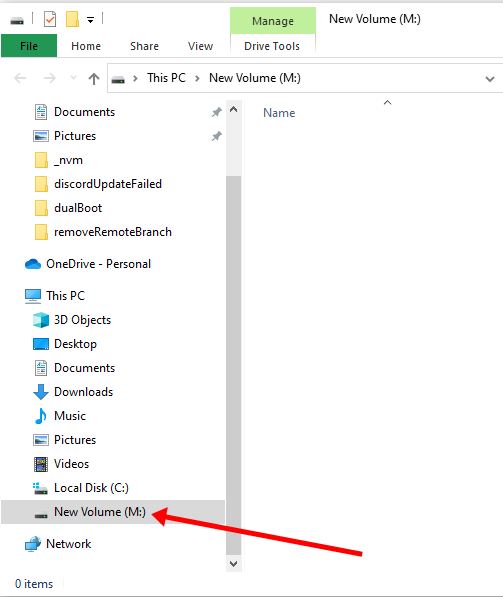

***Note***: Please find the solution of case-study-1 in below link

[Case-study-1](https://github.com/SunnyMaxwell/Linux-Practice/blob/main/Case-Study-1-README.md/)

1) ## Linux Distro Types

Linux is a Open Source Operating System designed from UNIX, Where we can find various flours with advance features'

  * Linux distributions, or distros, are variations of the Linux operating system. Each distro can come with a variety of desktop environments that provide graphical user interfaces (GUIs) and customization options. Here are some popular Linux distros

  * The Linux Distro we have various destop versions in order to use based on our requirement and features for it
  * Few of them are
    1) GNOME
    2) KDE Plasma
    3) Mate
    4) Pantheon
    5) XFCE
    6) Cinnamon and lot more
  * Out of them __GNOME__ is a popular, free, open-source desktop environment built for Linux operating systems. The word GNOME stands for GNU network model environment and offers users dependability, simplicity, and ease of access. Originally, GNOME was developed under a GNOME project built by paid contributors and volunteers.

  * This desktop environment comes with major Linux distros such as RHEL, Fedora, SUSE Linux, Ubuntu, Debian, and many more. Moreover, it also supports GTK-based applications and extensions to extend its options.

  * __More Over it look Like Windows GUI__

___Note: Although Ubuntu GNOME 16.04.5 is supported until April 2019, we strongly encourage you to install the regular Ubuntu 18.04 LTS release which features a minimally customized GNOME desktop.___

  * ### Customization:

  1. GNOME: Highly customizable with GNOME Tweaks, extensions from the GNOME Extensions website, and various themes.

  2. KDE Plasma: One of the most customizable environments, offering a wide range of widgets, themes, and settings through KDE System Settings.

  3. Xfce: Lightweight and easily customizable through its settings manager and plugins.
  
  4. LXQt: Lightweight with basic customization options.

  5. MATE: A continuation of GNOME 2, offering familiar customization through MATE Tweak and panel applets.

  * ### Customization Features Across Desktop Environments
  
  1. Themes: Change the overall appearance, including window decorations, icons, and controls.

  2. Widgets/Applets/Extensions: Add functionality and information displays to panels and desktops.

  3. Panel Configurations: Adjust the position, size, and behavior of panels.

  4. Wallpaper and Icons: Easily change desktop backgrounds and icon sets.

  5. Shortcuts and Hotkeys: Customize keyboard shortcuts and hotkeys for various actions.

___Each desktop environment and distro offers different levels of customization, allowing users to create a personalized experience suited to their preferences and hardware capabilities.___

2) ## Dual Boot System

    1. ### Steps to create A Partition In Your Hard Drive

    * In Windows Searchbar at Task bar search for "___Control Panel___" and Open it
    * Navigate below flow to Open Disk Mangement
    * ___Control Panel > System and Security > Under Administrative Tools > Open Create And Format Hard Disk Partitions___.

    

    * Right Click on Your Main Partition and select "___Shink Volume___" to make Some Space for New Partition

    

    * A minimum 10 GB of Free hard Drive Space is Required For Installation For ___Ubuntu GNOME___.

    * Change the amount of space to shink in MB. It should be minimum of 10000 MB and Click on Shrink button below.

    

    * optional): You can go ahead and assign a letter to the new volume. Right-click on the unallocated space and select “New Simple Volume”.

    * Assign a letter to the drive, then follow the rest of it.

    * After completing the wizard, the drive should be listed on your computer.

    

    #### Congrats! You’ve successfully partitioned your hard drive.

    2. ### Create a Bootable Ubuntu-GNOME USB Drive

    * You need a 4GB USB Drive.

    * Download the [Ubuntu GNOME ISO](https://wiki.ubuntu.com/UbuntuGNOME/GetUbuntuGNOME) and use a tool like 
    [Rufus](https://rufus.ie/en/) to create a bootable USB drive.

    * Make sure to copy Ubuntu ISO File into USB using "___Rufus___".

    3. ### Boot Ubuntu Linux Distro along with Windows 10 - USB Drive

    * Remove all unnecessary USB and external devices connected to it. And Ensure the bootable drive is inserted into your Windows 10 PC

    * Ensure the bootable drive is inserted into your Windows 10 PC

    

    * On completing the above process, in your computer system will see "___Choose an Option___", you will be perfectly done with it. 

    * Select "___Use a Device___"

    

    * On the next screen, you should see several devices you can boot from. - You may see the bootable drive as the name of the USB brand.

    * If you still cannot see your bootable drive, head over to your boot menu by getting into BIOS. You will see it there.

    * Choose "Install Ubuntu". You can also try it before installing it.

    * When you get to the point to select the partition you made, scroll to the partition you made earlier and press ENTER.

    ___Notes: Follow other prompts until Ubuntu starts installing.___

    * After the installation is done, Ubuntu will prompt you to remove the bootable drive and press ENTER to reboot your Computer.

    * Restart the PC

    4. ### Choose Operating System on Startup

    * After rebooting, you’ll see the GRUB menu, where you can choose to boot into Ubuntu or Windows.

    5. ### Make default Operating Sysytem as Windows

    * Boot into Windows OS

    * In Windows Searchbar at Task bar search for ___System Configuration___, and press Enter
    
    * Click on Boot tab from the window and check if OS installed drives are displayed.
    
    * Click on the operating system you want to boot from and click on Set as default.
    
    * Click on Apply and OK.
    
    * Close the window, reboot the PC

3) ## Linux Applications

1. **Office Suites**

   - **LibreOffice**: A free and open-source office suite that serves as a replacement for Microsoft Office. It includes Writer (Word), Calc (Excel), Impress (PowerPoint), Draw (Visio), and Base (Access).

   - **OnlyOffice**: Another alternative offering compatibility with MS Office formats.

2. **Web Browsers**

   - **Firefox**: Available on both Windows and Linux, providing a consistent browsing experience.
   - **Chromium**: The open-source version of Google Chrome.

3. **Email Clients**

   - **Thunderbird**: A powerful email client that can replace Microsoft Outlook.

4. **Image Editing**

   - **GIMP (GNU Image Manipulation Program)**: An alternative to Adobe Photoshop.

   - **Inkscape**: Used for vector graphics, similar to Adobe Illustrator.

5. **Video Editing**

   - **Kdenlive**: A robust video editor that can replace Adobe Premiere.

   - **Shotcut**: Another video editor with a user-friendly interface.

6. **Audio Editing**

   - **Audacity**: A popular audio editor similar to Adobe Audition.

7. **Media Players**

   - **VLC Media Player**: Available on multiple platforms, including Linux and Windows.

   - **MPV**: A lightweight media player.

8. **File Management**

   - **Nautilus**: The default file manager for GNOME, similar to Windows Explorer.

   - **Dolphin**: The file manager for KDE Plasma.

11. **Development Tools**

    - **Visual Studio Code**: Available on both Windows and Linux.

    - **Eclipse**: An integrated development environment (IDE) for Java and other languages.

    - **PyCharm**: An IDE for Python, available on multiple platforms.

4) ## Software Update and Package Management Systems

Linux distributions use package management systems to handle software installation, updates, and removal. These systems help maintain software consistency and simplify the process of managing dependencies. Here's an overview of the most common package management systems:

1. **APT (Advanced Package Tool)**

   - **Used By**: Debian, Ubuntu, and their derivatives (e.g., Linux Mint).

   - **Command Line Tools**: `apt`, `apt-get`.

   - **Features**: Simplifies the process of installing, updating, and removing software packages. It resolves dependencies automatically.

2. **YUM (Yellowdog Updater Modified) and DNF (Dandified YUM)**
   - **Used By**: Fedora, CentOS, and RHEL (Red Hat Enterprise Linux).

   - **Command Line Tools**: `yum` (older versions), `dnf` (modern versions).

   - **Features**: Handles package management with automatic dependency resolution. DNF is the modern replacement for YUM, providing better performance and additional features.

3. **RPM (Red Hat Package Manager)**

   - **Used By**: Fedora, CentOS, RHEL, openSUSE, and others.

   - **Command Line Tools**: `rpm`.

   - **Features**: The core package format used by YUM and DNF. It can handle individual package files and perform queries on the package database.

4. **Snap**

   - **Used By**: Ubuntu and other distributions with Snap support.

   - **Command Line Tools**: `snap`.

   - **Features**: Allows for the installation of "snap" packages that are containerized, enabling easy distribution and updates across different Linux distributions.

### Software Update Processes

- **System Updates**: Package managers can update the entire system, including the kernel, system libraries, and applications.

  - **APT**: `sudo apt update` to refresh package lists, followed by `sudo apt upgrade` or `sudo apt full-upgrade` to update packages.

  - **DNF**: `sudo dnf check-update` to refresh, followed by `sudo dnf upgrade` to update.

  - **yum**: `sudo yum update` to update the system, followed by `sudo yum update <pkg_name>` to update packages.

  ### Conclusion

  Linux offers a robust ecosystem of applications and tools that provide powerful alternatives to Windows software. The various package management systems and update processes make it straightforward to install, manage, and keep software up to date, ensuring a stable and secure operating environment.