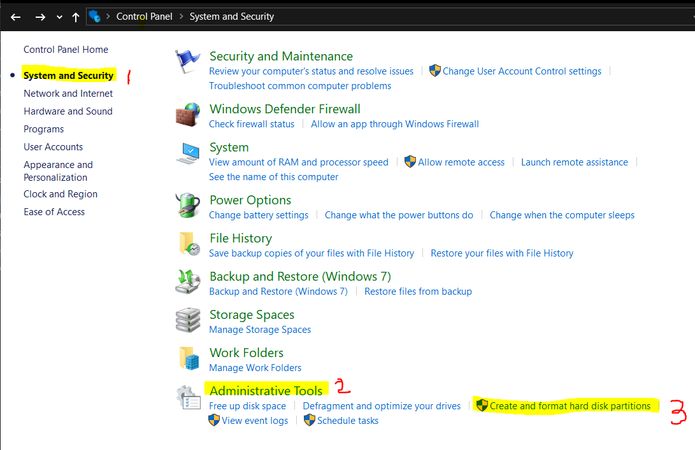

1) ## Linux Distro Types

Linux is a Open Source Operating System designed from UNIX, Where we can find various flours with advance features'
  * The Linux Distro we have various destop versions in order to use based on our requirement and features for it
  * Few of them are
    1) GNOME
    2) KDE Plasma
    3) Mate
    4) Pantheon
    5) XFCE
    6) Cinnamon and lot more
  * Out of them __GNOME__ is a popular, free, open-source desktop environment built for Linux operating systems. The word GNOME stands for GNU network model environment and offers users dependability, simplicity, and ease of access. Originally, GNOME was developed under a GNOME project built by paid contributors and volunteers.

  * This desktop environment comes with major Linux distros such as RHEL, Fedora, SUSE Linux, Ubuntu, Debian, and many more. Moreover, it also supports GTK-based applications and extensions to extend its options.

  * __More Over it look Like Windows GUI__

___Note: Although Ubuntu GNOME 16.04.5 is supported until April 2019, we strongly encourage you to install the regular Ubuntu 18.04 LTS release which features a minimally customized GNOME desktop.___

2) ## Dual Boot System

    1. ### Steps to create A Partition In Your Hard Drive

    * In Windows Searchbar at Task bar search for "___Control Panel___" and Open it
    * Navigate below flow to Open Disk Mangement
    * ___Control Panel > System and Security > Under Administrative Tools > Open Create And Format Hard Disk Partitions___.

    

    * Right Click on Your Main Partition and select "___Shink Volume___" to make Some Space for New Partition

    

    * A minimum 10 GB of Free hard Drive Space is Required For Installation For ___Ubuntu GNOME___.

    * Change the amount of space to shink in MB. It should be minimum of 10000 MB and Click on Shrink button below.

    

    2. ### Create a Bootable Ubuntu-GNOME USB Drive

    * You need a 4GB USB Drive.

    * Download the [Ubuntu GNOME ISO](https://wiki.ubuntu.com/UbuntuGNOME/GetUbuntuGNOME) and use a tool like 
    [Rufus](https://rufus.ie/en/) to create a bootable USB drive.

    * Make sure to copy Ubuntu ISO File into USB using "___Rufus___".

    3. ### Boot Ubuntu Linux Distro along with Windows 10 - USB Drive

    * Remove all unnecessary USB and external devices connected to it. And Ensure the bootable drive is inserted into your Windows 10 PC

    * Ensure the bootable drive is inserted into your Windows 10 PC

    

    * On completing the above process, in your computer system will see "___Choose an Option___", you will be perfectly done with it. 

    * Select "___Use a Device___"

    

    * On the next screen, you should see several devices you can boot from. - You may see the bootable drive as the name of the USB brand.

    * If you still cannot see your bootable drive, head over to your boot menu by getting into BIOS. You will see it there.

    * Choose "Install Ubuntu". You can also try it before installing it.

    * When you get to the point to select the partition you made, scroll to the partition you made earlier and press ENTER.

    ___Notes: Follow other prompts until Ubuntu starts installing.___

    * After the installation is done, Ubuntu will prompt you to remove the bootable drive and press ENTER to reboot your Computer.

    * Restart the PC

    4. ### Choose Operating System on Startup

    * After rebooting, you’ll see the GRUB menu, where you can choose to boot into Ubuntu or Windows.

    5. ### Make default Operating Sysytem as Windows

    * Boot into Windows OS

    * In Windows Searchbar at Task bar search for ___System Configuration___, and press Enter
    
    * Click on Boot tab from the window and check if OS installed drives are displayed.
    
    * Click on the operating system you want to boot from and click on Set as default.
    
    * Click on Apply and OK.
    
    * Close the window, reboot the PC

