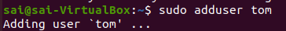
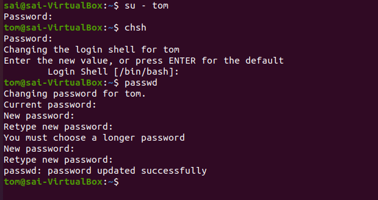
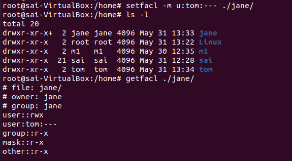
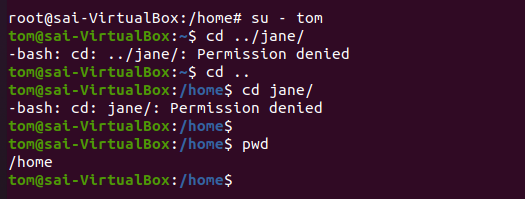
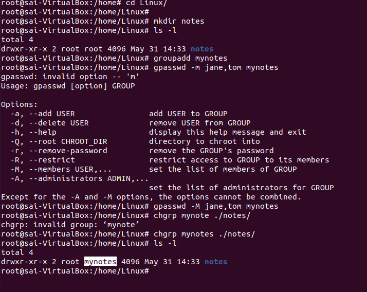
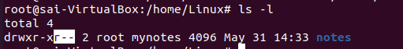

# Linux-Practice

## Case Study-2

### User Administation

1) sudo adduser jane

2) sudo adduser tom

3) Change Tom shell and update his password

4) Tom shouldn’t be able to access jane home folder

    

    Tom was able to access jane home directory.
        
    4.1) Check the access level for jane home directory ls -l in home directory

    \

    4.2) We can see the default permission for other is "Read and Execute"

    4.3) Change the Permisssions for jane home directory using 'setfacl'

    

    4.4) User Tom has no access to jane home dir

    

5) Notes - Folder

    5.1) Create a directory notes under Linux using "mkdir"
    5.2) Create a group called "mynotes" using "groupadd"
    5.3) Add jane and tom to that group using "gpasswd -M"
    5.4) Change group ownership to "mynotes" for Folder notes using "chgrp"

    

    5.5) Change group permission to all

    

    5.6) Change others (guest permission) to read only

    

    5.7) Create a group called "other-friends" using "groupadd"
    5.8) Set the permission same as mynotes group to "other-friends"

6) Research - Folder

    6.1) Create a directory research under Linux Folder using "mkdir"
    
    6.2) Change group ownership and directory ownership to "jane" for folder "research" using "chown"

    

    6.3) Remove Permissions for other users using "chmod"

    